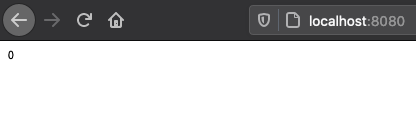

# web-print-2
Dynamic web site which prints Zero - in golang

# Pre-requirements

- [go language](https://golang.org/)

## Install pre-requirements

Depends on the OS which you are working, [download](https://golang.org/dl/) appropriate go lang packages and install it.

# How to use

```bash
git clone git@github.com:base-line/web-print-2.git
cd web-print-2
```

build the packages
```go
go build main.go
./main
```

or run it
```go
go run main.go
```

## Check the browser
